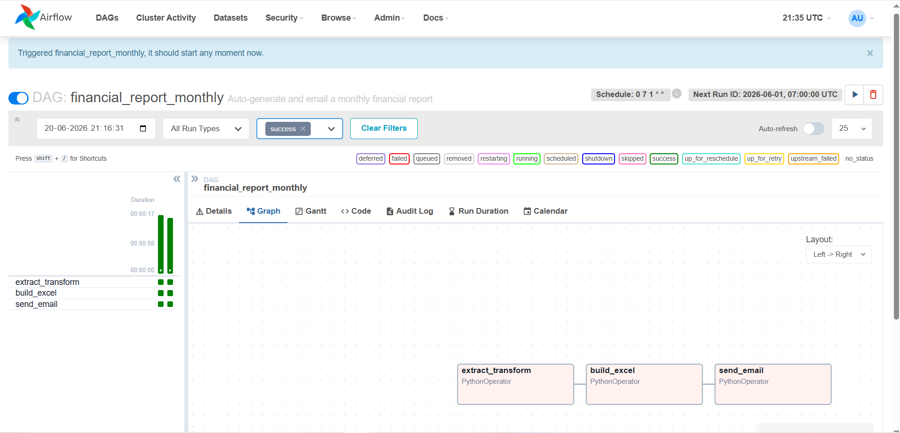
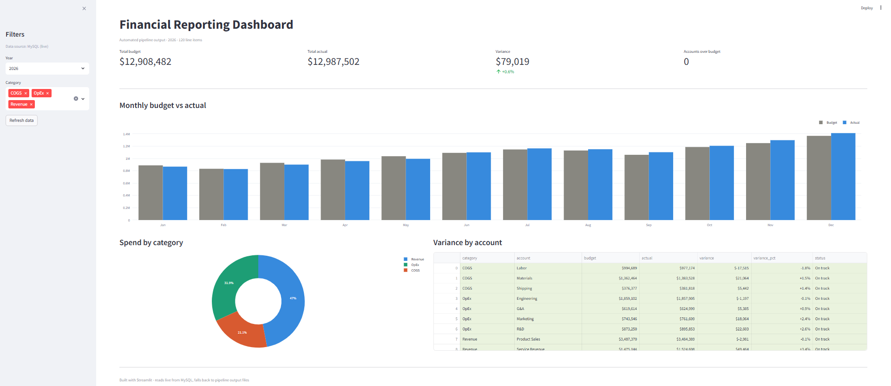
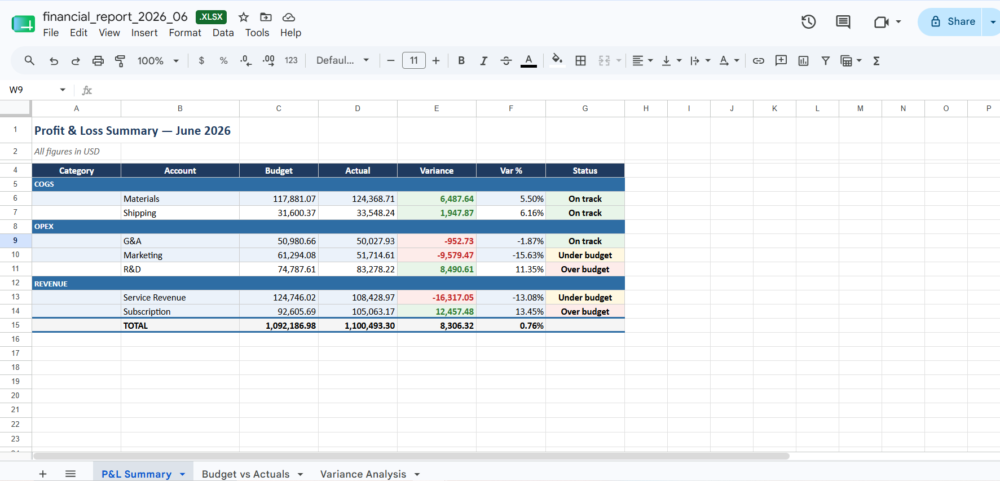

# 📊 Automated Financial Reporting Pipeline

An end-to-end data pipeline that pulls financial data from MySQL, transforms it,
generates a polished multi-sheet Excel report, emails it on a monthly schedule,
and powers a live Streamlit dashboard — fully containerized and orchestrated
with Apache Airflow.

Built to demonstrate the data engineering, BI, and FP&A workflow skills behind
roles like **BI Analyst**, **Financial Analyst**, and **Strategy & Operations**.


---

## What it does

```
MySQL (ledger data)
      │
      ▼
┌─────────────────┐     ┌──────────────┐     ┌─────────────┐
│ extract_transform│ ──▶ │ build_excel  │ ──▶ │ send_email  │
└─────────────────┘     └──────────────┘     └─────────────┘
      │                        │                     │
      ▼                        ▼                     ▼
  parquet file          financial_report.xlsx   Gmail inbox
                                │
                                ▼
                      ┌───────────────────┐
                      │ Streamlit dashboard│ ◀── reads MySQL live
                      └───────────────────┘
```

Every month, Airflow pulls the latest ledger data from MySQL, computes
budget-vs-actual variance, builds a three-sheet Excel workbook, and emails it
to a distribution list — with zero manual steps. A live dashboard sits
alongside it for anyone who wants the numbers without waiting for email.

---

## Screenshots

| Airflow DAG (all green) | Streamlit dashboard |
|:---:|:---:|
|  |  |



| Airflow DAG (all green) | Streamlit dashboard | Excel report |
|:---:|:---:|:---:|
| *3-task pipeline, scheduled monthly* | *Live KPIs + charts from MySQL* | *P&L, Budget vs Actuals, Variance* |

>`docs/airflow.PNG`, `docs/dashboard.PNG`, `docs/excel.PNG`

---

## Tech stack

| Layer | Tool |
|---|---|
| Orchestration | Apache Airflow 2.9 |
| Database | MySQL 8.0 |
| Transformation | pandas |
| Report generation | openpyxl |
| Dashboard | Streamlit + Plotly |
| Email delivery | Gmail SMTP |
| Containerization | Docker Compose (6 services) |

---

## Project structure

```
financial-reporter/
├── dags/
│   └── financial_report_dag.py   # Airflow DAG: extract → build → email
├── dashboard/
│   └── app.py                     # Streamlit live dashboard
├── src/
│   ├── data/generate_data.py      # MySQL query (+ sample-data fallback)
│   ├── report/excel_builder.py    # openpyxl: 3 sheets + embedded chart
│   └── notify/emailer.py          # Gmail SMTP delivery
├── seed_mysql.py                  # One-time job: creates + seeds ledger table
├── run_local.py                   # Quick local test, no Docker required
├── docker-compose.yml             # Airflow + MySQL + Postgres + Dashboard
├── Dockerfile.airflow             # Custom Airflow image (deps pre-installed)
├── Dockerfile.seed                # MySQL seeding job image
├── Dockerfile.dashboard           # Streamlit dashboard image
└── requirements.txt
```

---

## Quickstart — local only (no Docker)

```bash
pip install -r requirements.txt
python run_local.py
```

Generates a report in `output/` using locally-generated sample data — useful
for testing report formatting without standing up the full stack.

---

## Full deployment — Docker Compose

### 1. Gmail App Password
Create one at [myaccount.google.com/apppasswords](https://myaccount.google.com/apppasswords)
(requires 2-Step Verification enabled).

### 2. Configure credentials
Edit `docker-compose.yml`:
```yaml
SMTP_FROM: your_email@gmail.com
SMTP_USER: your_email@gmail.com
SMTP_PASS: xxxx xxxx xxxx xxxx
REPORT_RECIPIENTS: team@yourcompany.com
```

### 3. Start everything
```bash
docker compose up -d
```
First run builds 3 custom images (Airflow + deps, MySQL seeder, dashboard) —
takes a few minutes. Subsequent runs start in seconds.

### 4. Explore
| Service | URL | Notes |
|---|---|---|
| Airflow | http://localhost:8080 | `admin` / `admin` — trigger `financial_report_monthly` manually |
| Dashboard | http://localhost:8501 | Live KPIs, filterable by year/category |

### Schedule
Runs automatically **7am on the 1st of every month** — see the `schedule`
field in `dags/financial_report_dag.py`.

---

## Report contents

| Sheet | What's in it |
|---|---|
| **P&L Summary** | Budget vs actual per account, $ variance, % variance, status badge (over/under/on-track) |
| **Budget vs Actuals** | Monthly breakdown per account + embedded bar chart |
| **Variance Analysis** | Accounts ranked by absolute variance, with auto-flagged action items |

## Dashboard contents

KPI cards (total budget, total actual, variance, accounts over budget),
monthly budget-vs-actual bar chart, spend-by-category donut, and a
color-coded variance table — filterable by year and category, refreshable
on demand.

---

## Swapping in your own data

The pipeline doesn't care where rows come from as long as the schema matches.
Point `DATABASE_URL` at your own MySQL instance and adjust the `SELECT` in
`fetch_ledger_from_db()` (`src/data/generate_data.py`) to match your table.

---

## Build & debug notes

This project was built and debugged end-to-end on Windows + Docker Desktop,
which surfaced a realistic set of infrastructure problems beyond the code
itself:

- **BIOS virtualization disabled** — Docker Desktop wouldn't start until
  Intel VT-x was enabled in BIOS and WSL2 was properly configured.
- **Airflow's `_PIP_ADDITIONAL_REQUIREMENTS`** reinstalls packages on every
  container start — replaced with a custom `Dockerfile.airflow` that bakes
  dependencies in at build time (faster, and the officially recommended
  approach for anything beyond quick testing).
- **Windows volume permission errors** — `airflow-init` couldn't write to
  the mounted `logs/` folder; fixed by running the init step as root and
  setting permissions explicitly before handing off to the `airflow` user.
- **SQLAlchemy 1.4 vs 2.x incompatibilities** — `pd.read_sql()` with a raw
  query string behaved differently across versions in three separate places
  (the dashboard, the DAG's data layer). Fixed by querying through
  `engine.connect()` + `conn.execute(sa.text(...))` directly and building
  the DataFrame from the result set, which is stable across both versions.
- **Docker build context errors on Windows** — a symlink left behind by
  Airflow's logs (`logs/scheduler/latest`) blocked `docker build` from
  reading the project directory; solved with a `.dockerignore` excluding
  `logs/`, `venv/`, and `output/` from build contexts.

Each of these is the kind of issue that shows up in real local-dev and
CI environments, not just in this project.

---

## Roadmap / possible extensions

- [ ] Data quality checks (null/negative-value validation) with Slack/email alerting on failure
- [ ] CI workflow (GitHub Actions) to lint and smoke-test on every push
- [ ] Cloud deployment — Cloud Composer (Airflow) + Cloud SQL (MySQL)
- [ ] Forecasting sheet using historical trend data
- [ ] Public dashboard deploy via Streamlit Community Cloud
